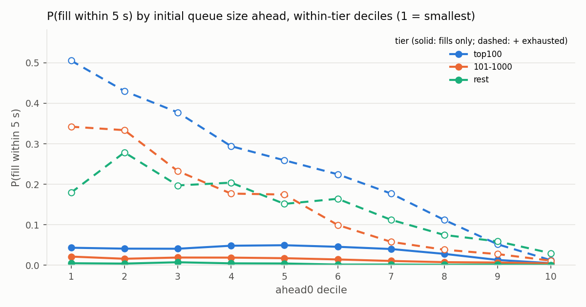

# lob-reconstruct — NASDAQ ITCH 5.0 Level-3 order book reconstruction

A full-day NASDAQ TotalView-ITCH 5.0 parser and Level-3 limit order book reconstructor in Java 21. It replays a whole
trading day (269 million messages, every symbol), rebuilds every book order by order, and checks itself three ways:
structural invariants on every message, price-time priority against the exchange's own executions, and an independent
implementation (MeatPy) at every minute of the day. It was then optimised in measured steps from a credible naive baseline
to an allocation-free hot path, and used to produce one number that needs order-level data to exist: the exact fill
probability of an order joining the queue at the touch, conditioned on how much is ahead of it.

Every figure below is copied from a generated file: `research/results/numbers_<day>.md` (research, written by
`research/report.py`) or `docs/perf.md` (performance, written from `ops/bench.sh` output). Nothing is typed in by hand.

## Results

Machine: AMD Ryzen 5 6600HS laptop (6C/12T), 13.7 GB usable RAM, NVMe SSD, Windows 11, Temurin JDK 21.0.12, single thread.
Days: `12302019` (30 Dec 2019) in full; `01302020` and `S120825` are being run through the same pipeline (see
[Cross-day](#cross-day)).

### Correctness

| check | 12302019 |
|---|---|
| structural violations (bad length, unknown type, duplicate ref, unknown ref, exec > remaining, cancel > remaining) | **0** |
| crossed book in market hours, trading state T | **0** unexplained; 642 within 1 s of a halt/IPO resumption (max lag 1.21 ms) |
| duplicate match numbers / broken trades referencing an unseen match | 0 / 0 (4,324 two-sided matches, one printable and one non-printable leg) |
| price-time priority: executions in market hours hitting the head of the best level | 10,565 violations / 5,683,178 checked = **0.19 %** |
| … classified | 89.5 % bursts (one match event's fills reported in non-FIFO order), 10.5 % isolated (44.5 % odd lots; self-match prevention is the working hypothesis), **0 off-best, 0 gate bugs** |
| MeatPy top-of-book diff, AAPL, every minute 9:30–16:00 | **391 / 391 identical** (bid, ask, both sizes); per-type message counts identical on all 18 types |
| live orders at end of day (`C`) | 0 |
| queue anomalies (an order behind a joiner filled first) | **0** of 917,092 episodes |

The reference implementation took 3,379 s for one symbol; this engine took 178 s for every symbol including the export.

### Performance (naive → optimised, G1, full day, median of 3)

| step | replaces | msgs/s | wall | B/msg | subset p50 | p99 | p99.9 |
|---|---|---|---|---|---|---|---|
| naive | `HashMap<Long,Order>`, `TreeMap` levels, object per order | 1,117,442 | 240.5 s | 156.8 | 400 ns | 1,900 ns | 14.8 µs |
| +mmap | `MappedByteBuffer` windows | 1,123,045 | 239.3 s | 156.8 | 300 | 1,400 | 5.6 µs |
| +long | open-addressing `long` keys | 1,104,128 | 243.4 s | 102.3 | 300 | 1,400 | 5.6 µs |
| +array | sorted-array book | 1,602,533 | 167.7 s | 34.7 | 200 | 1,400 | 2.8 µs |
| +pool | order free list | 1,693,414 | 158.7 s | 5.9 | 200 | 1,400 | 2.7 µs |
| +dedupe | BBO change detection | 1,625,800 | 165.3 s | 5.9 | 201 | 1,501 | 3.2 µs |

**1.5× throughput, 26× less allocation, p99.9 14.8 → 2.7 µs, subset GCs 5 → 0.** The 10× target was not met and the reason
is measured: the `+long` row cut allocation by 35 % and moved wall time by nothing, so once per-message garbage is gone the
day is bound by memory latency on a map of up to 1.9 million live orders, not by the collector. Generational ZGC is ~1.5×
slower than G1 at the same heap on every row, and its optimised-row tail is worse (6.7 vs 2.7 µs): fix the allocation, then
pick the collector. Full tables, JFR allocation sites, and the abandoned non-generational ZGC pass are in
[`docs/perf.md`](docs/perf.md).

### Research (12302019; tiers by that day's volume rank: top100, 101–1000, rest)

**Queue position.** 917,092 exact joiner episodes on 59 symbols: a hypothetical order joins the back of the touch at the
first top-of-book change after each 1-second grid point, and every execution or cancel of the orders ahead of it is tracked.
Fill probability is a band because the reconstructed book cannot contain the joiner: the lower bound counts observed fills,
the upper bound also counts episodes where everything ahead cleared and the level then emptied (D29).

| P(fill within T), midday, lower – upper | 5 s | 60 s |
|---|---|---|
| top100 | 3.2 % – 24.0 % | 12.8 % – 41.1 % |
| 101–1000 | 1.1 % – 14.1 % | 10.1 % – 34.0 % |
| rest | 0.2 % – 13.8 % | 2.2 % – 34.8 % |

- **Conditional on queue size** (the headline): for top-100 names, P(fill within 5 s) falls monotonically from **50.6 %** in
  the smallest decile of shares ahead (≤ 200) to **1.2 %** in the largest (≥ 34,922), upper bound; the lower bound is flat
  around 4–5 % up to the sixth decile and then falls to 0.5 %. 101–1000: 34.2 % → 1.1 %; rest: 17.9 % → 3.0 %.
- **Cancellations are 88.2 % of all queue movement ahead of a joiner** (top100 ≈ 89 %, 101–1000 ≈ 75–81 %, rest ≈ 94–98 %):
  most of your progress in the queue comes from other people leaving, not from trades.
- The close is the easiest session to be filled in (top100 ≤ 60 s lower bound 20.9 % vs 12.8 % midday).

**Spreads** (bps of mid, volume-weighted, `E` and printable `C` only, 95 % CI by 5-minute block bootstrap): effective spread
top100 24.3 (open) / 23.5 (midday) / 35.0 (close); 101–1000 26.5 / 13.9 / 11.6; rest 79.6 / 33.5 / 25.2. The realised spread
at 30 s is **negative** for top100 (−25.5 open, −15.6 midday) and 101–1000 (−11.8, −7.1): in liquid names the liquidity
provider loses to adverse selection within 30 s; only the thin tier keeps a positive realised spread.

**OFI** (Cont, Kukanov & Stoikov; 1-second windows, per-symbol OLS, in-sample first 70 % of each session): median
out-of-sample R² top100 0.36–0.48 (92 % of symbols positive at midday), 101–1000 0.29–0.43, rest 0.06–0.14; β in ticks
per 1,000 shares of imbalance rises from 0.02–0.04 (top100) to 1.5–3.4 (rest), as depth scaling predicts.

Charts: `research/results/queue_12302019.png`, `queue_cond_12302019.png`, `spreads_12302019.png`.



### Cross-day

`01302020` (30 Jan 2020) and `S120825` (8 Dec 2025) run through `ops/make.ps1` unchanged; their `numbers_<day>.md` land in
`research/results/` and this section is updated from them. Structural counters are expected to be zero on all days; the
queue curves are expected to keep their shape with different levels.

## Design (ten lines)

- Files are the boundary: gunzip once, memory-map, `[len:2][msg]` frames into one reusable 64 KB buffer; the reader is the
  only thing that throws (truncation → `IOException` with byte offset, never a partial book).
- Prices stay `int` at the feed's native scale 4, shares `int`, timestamps `long` ns since midnight; no decimal parsing anywhere.
- Locate code is the array index (`books[65536]`), as the spec intends.
- `Order` is an intrusive doubly-linked node; `Level` is a FIFO keeping `shares == Σ order.shares`; `Book` and `OrderMap`
  are interfaces so the optimised structures dropped in behind property tests (`ArrayBook` ≡ `TreeBook`, `LongObjectMap` ≡ `HashMap`).
- `U` replace removes the old order and appends the new reference at the **back** of its level: time priority is lost (D22).
- `P` trades are unsigned since 2014 and disjoint from `E`/`C`; signed metrics use `E`/`C` only (D23).
- Every bad-data case increments a counter and continues; the crossed-book and priority checks are gated to market hours
  and trading state `T`, with a 1 s window after a resumption for the halt cross to drain (D26).
- A match number may carry one printable and one non-printable leg (D28).
- Listeners (`DerivedWriter`, `QueueProbe`, `MeatPyExport`, `LadderWriter`) hang off the engine; research episodes are
  computed in Java, Python only aggregates (D24).
- Golden test: derived output over a 5-minute fixture hashes identically for every optimisation, in CI.

Design spec, plans and the decision log (D1–D30) are kept in a separate notes vault; the daily log there is the source of
every number quoted.

## Honest limitations

- **Sample days only.** A handful of NASDAQ-published days, not a continuous history. Findings are per-day; cross-day
  consistency is checked on two or three days, not months.
- **NASDAQ only.** ITCH shows NASDAQ's book and NASDAQ's executions, not the consolidated market. Comparing to consolidated
  volume is wrong, not just imprecise, so it is not done.
- **No live component.** This is the reconstruction and analysis core of a feed handler, not the handler.
- **`P` trades are unsigned since 2014**, so signed metrics use displayed executions only.
- **Reference-parser agreement is not ground truth.** If MeatPy and this engine misread the same spec line, they agree and
  are both wrong.
- **The joiner is hypothetical.** Fill probability is a band, not a point (see D29).

## What I would change to run this at a bank

- Transport: MoldUDP64 sequencing, gap detection and re-request, GLIMPSE snapshot recovery, and a stated policy for what the
  desk sees during a gap (stale, blank, or flagged).
- Parallelism: partition by locate across threads; the engine is single-threaded by design and the measurements show it is
  bound by memory latency on the order map, which partitioning attacks directly.
- Telemetry: the validation counters become live metrics with alerts, and apply-latency histograms are exported per symbol shard.
- Memory: pre-size the order map and pools from the previous day's peak (1.9 M live orders here) so nothing grows intraday.

## Run it

Requires JDK 21, Maven, Python 3.12 (`research/requirements.txt`), ~30 GB of disk per day (gz, decompressed, derived, Parquet).

```powershell
powershell -ExecutionPolicy Bypass -File ops/download.ps1 -Name 12302019.NASDAQ_ITCH50.gz   # resume + md5 when published
powershell -ExecutionPolicy Bypass -File ops/make.ps1 -Day 12302019 -Gz 12302019.NASDAQ_ITCH50.gz
# -> data/derived/12302019/ (NDJSON, validation.json, priority.ndjson, episodes.ndjson, ladder_AAPL.ndjson)
# -> data/parquet/<table>/date=12302019/  and  research/results/numbers_12302019.md + charts
python demo/make_demo.py --ladder data/derived/12302019/ladder_AAPL.ndjson --symbol AAPL --date 12302019 --perf data/perf/12302019.txt
```

Every step runs as its own process with its exit code checked and its stderr kept next to its log, so a stage that dies
stops the day instead of leaving a half-written result behind. `bash ops/run_days.sh` does every day in `ops/days.txt`
one at a time and finishes with `research/crossday.py`, which reads the per-day generated files back and writes
[`research/results/crossday.md`](research/results/crossday.md) — the cross-day tables quoted above.

`mvn -B verify` runs the Java tests (unit, jqwik property, golden, corruption); `cd research && python -m pytest` the Python ones.
`ops/bench.sh` reproduces the performance matrix. Single runs of any stage: `java -cp … sg.phuc.lob.replay.Replay --help`-style
flags are listed at the top of `Replay.java`.

## Demo

`demo/index.html` replays AAPL from 9:28 to 9:32 through the opening cross: ten levels a side with the number of resting
orders at each price (the Level-3 detail a depth feed cannot show), the crossed pre-open book, the `Q` cross print, and the
engine's latency percentiles in the caption. Open it locally after `make_demo.py`, or via GitHub Pages once enabled for `/demo`.

Screencast storyboard: [`docs/screencast.md`](docs/screencast.md).
