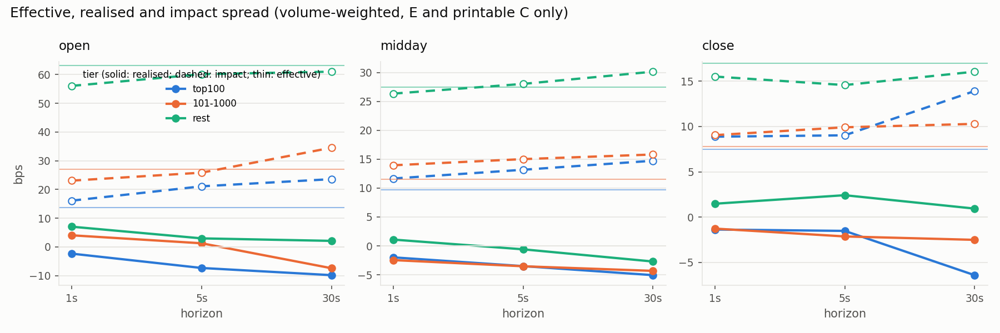
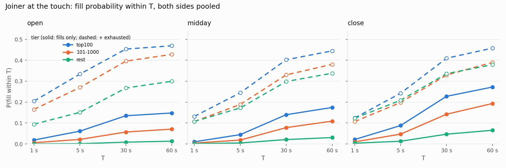
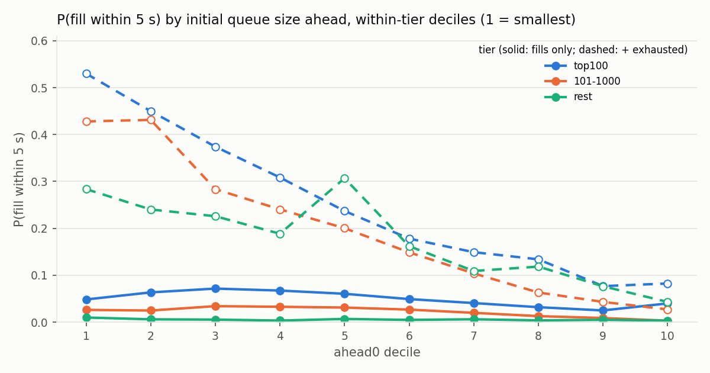

# numbers.md — 01302020

Every figure below is produced by `research/report.py` from the derived output of one full-day replay; nothing is typed in.
Prices in bps of the mid; sessions open [9:30, 10:00), midday [10:00, 15:30), close [15:30, 16:00) ET; tiers by that day's
E + printable C + P share volume rank (top100, 101-1000, rest), NASDAQ test symbols excluded.

## 1. Validation counters

Structural violations (six counters): **0**. Priority violation rate: **0.129 %** (10,744 / 8,301,831).

| counter                 |   value |
|:------------------------|--------:|
| badLength               |       0 |
| unknownType             |       0 |
| duplicateRef            |       0 |
| unknownRef              |       0 |
| execExceeds             |       0 |
| cancelExceeds           |       0 |
| noDirectory             |       0 |
| crossedInMarket         |       0 |
| crossedAtResume         |     458 |
| crossedAtResumeMaxLagNs | 1491186 |
| priorityChecked         | 8301831 |
| priorityViolations      |   10744 |
| duplicateMatch          |       0 |
| twoSidedMatches         |    5170 |
| brokenUnknown           |       0 |
| liveAtC                 |       0 |

## 2. Priority-violation classification

Violations dumped: **500**

| bucket | count | share | median queuePos | median levelCount | median burstSize | median execShares |
|---|---|---|---|---|---|---|
| burst | 360 | 72.0 % | 2 | 12 | 6 | 33 |
| isolated | 140 | 28.0 % | 2 | 11 | 1 | 50 |
| off_best | 0 | 0.0 % | — | — | — | — |
| gate_bug | 0 | 0.0 % | — | — | — | — |

## Detail

- burst: 75.8 % have an execution on the same symbol at the previous message's nanosecond (nsSinceLastExec == 0); queuePos 1 in 41.7 % of cases, <= 3 in 92.2 %.
- isolated: 59.3 % are odd-lot executions (< 100 shares); median nsSinceLastExec 2,565,866 ns; top symbols: CSCO (55), AAPL (19), ZYNE (10), AMD (8), FB (6).

## Top symbols overall

| sym   |   violations |
|:------|-------------:|
| CSCO  |          128 |
| AAPL  |           37 |
| ZYNE  |           27 |
| BIOS  |           26 |
| AMD   |           24 |
| FB    |           23 |
| MRVL  |           19 |
| BILI  |           18 |
| MSFT  |           15 |
| PDD   |           13 |

## 3. MeatPy cross-check (AAPL top-of-book at 1-minute marks)

_not run on this day (need meatpy_AAPL.csv and meatpy_01302020_AAPL.csv)_

## 4. Performance

See `docs/perf.md` (naive -> optimised tables, G1 and Generational ZGC, JFR). Not regenerated here.

## 5. Spreads by tier x session x horizon (volume-weighted bps; 95 % CI by 5-minute block bootstrap)

`eff` does not depend on the horizon; it is repeated per row for the CI. `impact = eff - real`.

| tier     | session   | h   |   n_exec |    volume |   eff |   eff_lo |   eff_hi |   real |   real_lo |   real_hi |   impact |   impact_lo |   impact_hi |
|:---------|:----------|:----|---------:|----------:|------:|---------:|---------:|-------:|----------:|----------:|---------:|------------:|------------:|
| top100   | open      | 1s  |   253126 |  49971478 | 13.74 |    12.14 |    15.37 |  -2.37 |     -3.09 |     -1.50 |    16.10 |       13.65 |       18.37 |
| top100   | open      | 5s  |   253126 |  49971478 | 13.74 |    12.17 |    15.34 |  -7.36 |    -11.21 |     -3.75 |    21.09 |       16.07 |       26.07 |
| top100   | open      | 30s |   253126 |  49971478 | 13.74 |    12.14 |    15.32 |  -9.85 |    -15.99 |     -4.93 |    23.59 |       17.21 |       30.83 |
| top100   | midday    | 1s  |  1135291 | 232429799 |  9.67 |     8.97 |    10.47 |  -1.98 |     -2.47 |     -1.48 |    11.66 |       11.04 |       12.27 |
| top100   | midday    | 5s  |  1135291 | 232429799 |  9.67 |     8.90 |    10.51 |  -3.50 |     -4.21 |     -2.77 |    13.17 |       12.37 |       14.00 |
| top100   | midday    | 30s |  1135291 | 232429799 |  9.67 |     8.85 |    10.55 |  -5.06 |     -6.17 |     -3.86 |    14.73 |       13.35 |       16.06 |
| top100   | close     | 1s  |   194470 |  45199764 |  7.50 |     6.59 |     8.52 |  -1.37 |     -3.04 |     -0.14 |     8.87 |        7.98 |       10.42 |
| top100   | close     | 5s  |   194470 |  45199764 |  7.50 |     6.59 |     8.57 |  -1.52 |     -3.47 |     -0.08 |     9.02 |        7.88 |       11.02 |
| top100   | close     | 30s |   194470 |  45199764 |  7.50 |     6.59 |     8.53 |  -6.40 |     -9.83 |     -2.35 |    13.91 |        8.87 |       17.81 |
| 101-1000 | open      | 1s  |   406937 |  52529626 | 27.10 |    17.74 |    35.96 |   4.02 |     -2.48 |     11.43 |    23.07 |       18.70 |       26.38 |
| 101-1000 | open      | 5s  |   406937 |  52529626 | 27.10 |    17.53 |    35.67 |   1.24 |     -4.39 |      6.61 |    25.85 |       19.40 |       30.75 |
| 101-1000 | open      | 30s |   406937 |  52529626 | 27.10 |    17.12 |    35.04 |  -7.44 |    -15.28 |     -0.77 |    34.53 |       22.75 |       48.41 |
| 101-1000 | midday    | 1s  |  2981426 | 312807846 | 11.49 |    10.37 |    12.93 |  -2.46 |     -3.44 |     -1.23 |    13.95 |       13.18 |       14.68 |
| 101-1000 | midday    | 5s  |  2981426 | 312807846 | 11.49 |    10.32 |    12.81 |  -3.52 |     -4.63 |     -2.07 |    15.01 |       14.16 |       16.01 |
| 101-1000 | midday    | 30s |  2981426 | 312807846 | 11.49 |    10.42 |    12.60 |  -4.32 |     -5.47 |     -2.96 |    15.81 |       14.79 |       16.80 |
| 101-1000 | close     | 1s  |   678615 |  76727633 |  7.78 |     6.79 |     8.47 |  -1.27 |     -2.60 |     -0.58 |     9.04 |        8.15 |       10.60 |
| 101-1000 | close     | 5s  |   678615 |  76727633 |  7.78 |     6.79 |     8.59 |  -2.13 |     -3.29 |     -1.51 |     9.91 |        8.75 |       11.55 |
| 101-1000 | close     | 30s |   678615 |  76727633 |  7.78 |     6.85 |     8.47 |  -2.51 |     -4.04 |     -1.68 |    10.28 |        8.80 |       12.37 |
| rest     | open      | 1s  |   177999 |  16467404 | 63.11 |    51.99 |    72.40 |   7.02 |     -0.39 |     14.87 |    56.09 |       47.52 |       64.34 |
| rest     | open      | 5s  |   177999 |  16467404 | 63.11 |    52.71 |    72.86 |   2.96 |     -5.01 |     13.54 |    60.15 |       50.51 |       72.21 |
| rest     | open      | 30s |   177999 |  16467404 | 63.11 |    53.32 |    71.86 |   2.08 |     -4.57 |     13.67 |    61.02 |       52.55 |       70.49 |
| rest     | midday    | 1s  |  2022868 | 128449428 | 27.43 |    25.30 |    30.13 |   1.09 |     -0.40 |      2.88 |    26.34 |       24.75 |       27.85 |
| rest     | midday    | 5s  |  2022868 | 128449428 | 27.43 |    25.27 |    30.26 |  -0.59 |     -2.57 |      1.61 |    28.02 |       26.44 |       29.68 |
| rest     | midday    | 30s |  2022868 | 128449428 | 27.43 |    25.08 |    30.03 |  -2.70 |     -4.99 |     -0.34 |    30.13 |       28.15 |       32.66 |
| rest     | close     | 1s  |   562818 |  36509518 | 16.98 |    16.13 |    18.41 |   1.48 |     -1.35 |      2.98 |    15.51 |       13.46 |       19.27 |
| rest     | close     | 5s  |   562818 |  36509518 | 16.98 |    16.14 |    18.20 |   2.42 |     -2.72 |      5.45 |    14.57 |       10.84 |       20.85 |
| rest     | close     | 30s |   562818 |  36509518 | 16.98 |    16.12 |    18.27 |   0.94 |     -3.57 |      3.40 |    16.04 |       12.81 |       21.74 |

## 6. OFI: 1-second mid change (ticks) on OFI, per-symbol OLS, in-sample first 70 % of each session

Medians and quartiles across symbols with at least 30 in-sample and 10 out-of-sample windows; `beta` in ticks of mid change per
1,000 shares of imbalance; `share_r2_out_pos` = fraction of symbols whose out-of-sample R^2 is positive.

| tier     | session   |   symbols |   beta_med |   beta_q1 |   beta_q3 |   r2_in_med |   r2_out_med |   r2_out_q1 |   r2_out_q3 |   share_r2_out_pos |
|:---------|:----------|----------:|-----------:|----------:|----------:|------------:|-------------:|------------:|------------:|-------------------:|
| top100   | open      |       100 |      0.120 |     0.021 |     0.430 |       0.510 |        0.474 |       0.249 |       0.616 |              0.940 |
| top100   | midday    |       100 |      0.057 |     0.009 |     0.274 |       0.605 |        0.578 |       0.442 |       0.664 |              0.990 |
| top100   | close     |        98 |      0.039 |     0.008 |     0.183 |       0.662 |        0.345 |       0.124 |       0.558 |              0.796 |
| 101-1000 | open      |       890 |      1.075 |     0.198 |     4.895 |       0.366 |        0.303 |       0.060 |       0.486 |              0.782 |
| 101-1000 | midday    |       898 |      0.488 |     0.103 |     2.273 |       0.504 |        0.514 |       0.338 |       0.611 |              0.958 |
| 101-1000 | close     |       879 |      0.358 |     0.067 |     1.647 |       0.603 |        0.295 |      -0.138 |       0.487 |              0.699 |
| rest     | open      |      4093 |      3.061 |     0.715 |    10.500 |       0.189 |        0.096 |      -0.124 |       0.332 |              0.611 |
| rest     | midday    |      6014 |      1.759 |     0.488 |     5.872 |       0.202 |        0.169 |       0.033 |       0.365 |              0.824 |
| rest     | close     |      4267 |      1.551 |     0.434 |     4.815 |       0.285 |        0.080 |      -0.043 |       0.321 |              0.663 |

## 7. Queue-position fill probability (exact joiner episodes)

Episodes: **1,100,166** over 59 probed symbols (655,652 top100, 347,752 101-1000, 96,762 rest), both sides, sampled at the first
top-of-book change at or after each 1-second grid point, censored at 60 s. Outcome shares: filled 14.7 %, moved 45.3 %, exhausted 27.2 %, T 12.8 %, eod 0.1 %. Anomaly rate (an order behind the joiner filled first) 0.00 %. Cancellation share of queue movement ahead of joiners: **90.6 %**.

`p_fill` counts observed fills only (a lower bound); `p_fill_upper` also counts `exhausted` episodes at their exhaustion time.

### 7.1 Overall

|    T_s |   p_fill |   p_fill_upper |           n |
|-------:|---------:|---------------:|------------:|
|  1.000 |    0.009 |          0.127 | 1100166.000 |
|  5.000 |    0.037 |          0.228 | 1100166.000 |
| 30.000 |    0.116 |          0.376 | 1100166.000 |
| 60.000 |    0.147 |          0.419 | 1100166.000 |

### 7.2 By tier x session (both sides)

| tier     | session   |      n |   p_fill_1s |   p_fill_5s |   p_fill_30s |   p_fill_60s |   p_fill_upper_5s |   p_fill_upper_60s |   cancel_share |   censor_moved |   censor_exhausted |   anomaly |   median_ahead0 |
|:---------|:----------|-------:|------------:|------------:|-------------:|-------------:|------------------:|-------------------:|---------------:|---------------:|-------------------:|----------:|----------------:|
| top100   | open      |  55460 |       0.019 |       0.061 |        0.135 |        0.148 |             0.334 |              0.469 |          0.892 |          0.507 |              0.321 |     0.000 |         700.000 |
| top100   | midday    | 542696 |       0.010 |       0.045 |        0.140 |        0.174 |             0.245 |              0.445 |          0.915 |          0.458 |              0.271 |     0.000 |        1400.000 |
| top100   | close     |  57496 |       0.021 |       0.088 |        0.228 |        0.272 |             0.242 |              0.458 |          0.839 |          0.437 |              0.186 |     0.000 |        2600.000 |
| 101-1000 | open      |  30202 |       0.006 |       0.022 |        0.057 |        0.071 |             0.270 |              0.428 |          0.925 |          0.524 |              0.357 |     0.000 |         300.000 |
| 101-1000 | midday    | 278936 |       0.004 |       0.019 |        0.078 |        0.109 |             0.189 |              0.380 |          0.933 |          0.420 |              0.271 |     0.000 |         406.000 |
| 101-1000 | close     |  38614 |       0.010 |       0.047 |        0.142 |        0.193 |             0.198 |              0.390 |          0.847 |          0.401 |              0.196 |     0.000 |         763.000 |
| rest     | open      |   7632 |       0.000 |       0.001 |        0.009 |        0.013 |             0.151 |              0.300 |          0.835 |          0.547 |              0.287 |     0.000 |         100.000 |
| rest     | midday    |  76396 |       0.002 |       0.005 |        0.021 |        0.030 |             0.172 |              0.338 |          0.883 |          0.493 |              0.308 |     0.000 |         100.000 |
| rest     | close     |  12734 |       0.004 |       0.013 |        0.047 |        0.065 |             0.209 |              0.379 |          0.806 |          0.475 |              0.313 |     0.000 |         100.000 |

### 7.3 By tier x session x side

| tier     | session   | side   |      n |   p_fill_5s |   p_fill_60s |   p_fill_upper_5s |   cancel_share |   median_ahead0 |
|:---------|:----------|:-------|-------:|------------:|-------------:|------------------:|---------------:|----------------:|
| top100   | open      | B      |  27730 |       0.064 |        0.153 |             0.334 |          0.909 |         800.000 |
| top100   | open      | S      |  27730 |       0.059 |        0.143 |             0.335 |          0.873 |         700.000 |
| top100   | midday    | B      | 271348 |       0.047 |        0.179 |             0.242 |          0.916 |        1400.000 |
| top100   | midday    | S      | 271348 |       0.042 |        0.170 |             0.247 |          0.914 |        1316.000 |
| top100   | close     | B      |  28748 |       0.087 |        0.243 |             0.229 |          0.900 |        2599.000 |
| top100   | close     | S      |  28748 |       0.089 |        0.301 |             0.256 |          0.775 |        2600.000 |
| 101-1000 | open      | B      |  15101 |       0.020 |        0.070 |             0.267 |          0.929 |         297.000 |
| 101-1000 | open      | S      |  15101 |       0.024 |        0.071 |             0.273 |          0.922 |         300.000 |
| 101-1000 | midday    | B      | 139468 |       0.017 |        0.099 |             0.190 |          0.931 |         407.000 |
| 101-1000 | midday    | S      | 139468 |       0.020 |        0.119 |             0.188 |          0.933 |         406.000 |
| 101-1000 | close     | B      |  19307 |       0.040 |        0.152 |             0.182 |          0.848 |         779.000 |
| 101-1000 | close     | S      |  19307 |       0.054 |        0.235 |             0.215 |          0.845 |         751.000 |
| rest     | open      | B      |   3816 |       0.000 |        0.012 |             0.140 |          0.805 |         100.000 |
| rest     | open      | S      |   3816 |       0.002 |        0.014 |             0.162 |          0.856 |         100.000 |
| rest     | midday    | B      |  38198 |       0.004 |        0.031 |             0.164 |          0.838 |         100.000 |
| rest     | midday    | S      |  38198 |       0.005 |        0.030 |             0.181 |          0.910 |         100.000 |
| rest     | close     | B      |   6367 |       0.014 |        0.080 |             0.200 |          0.759 |         102.000 |
| rest     | close     | S      |   6367 |       0.012 |        0.050 |             0.218 |          0.845 |         100.000 |

### 7.4 Conditional on initial queue size: P(fill within 5 s | ahead0 decile within tier) — the headline finding

| tier     |   decile |     n |   ahead0_min |   ahead0_median |   ahead0_max |   p_fill |   p_fill_upper |   cancel_share |
|:---------|---------:|------:|-------------:|----------------:|-------------:|---------:|---------------:|---------------:|
| top100   |        1 | 65566 |            1 |         100.000 |          100 |    0.048 |          0.530 |          0.529 |
| top100   |        2 | 65565 |          100 |         200.000 |          201 |    0.063 |          0.450 |          0.557 |
| top100   |        3 | 65565 |          201 |         300.000 |          400 |    0.072 |          0.374 |          0.575 |
| top100   |        4 | 65565 |          400 |         555.000 |          751 |    0.067 |          0.308 |          0.598 |
| top100   |        5 | 65565 |          751 |        1005.000 |         1400 |    0.060 |          0.237 |          0.639 |
| top100   |        6 | 65565 |         1400 |        1812.000 |         2500 |    0.049 |          0.178 |          0.679 |
| top100   |        7 | 65565 |         2500 |        3704.000 |         6000 |    0.041 |          0.149 |          0.720 |
| top100   |        8 | 65565 |         6000 |        8900.000 |        11600 |    0.032 |          0.134 |          0.873 |
| top100   |        9 | 65565 |        11600 |       15300.000 |        27200 |    0.025 |          0.077 |          0.879 |
| top100   |       10 | 65566 |        27200 |       78256.500 |       301600 |    0.040 |          0.082 |          0.942 |
| 101-1000 |        1 | 34776 |            1 |          29.000 |          100 |    0.026 |          0.428 |          0.535 |
| 101-1000 |        2 | 34775 |          100 |         100.000 |          100 |    0.025 |          0.431 |          0.600 |
| 101-1000 |        3 | 34775 |          100 |         159.000 |          200 |    0.034 |          0.283 |          0.512 |
| 101-1000 |        4 | 34775 |          200 |         210.000 |          300 |    0.033 |          0.240 |          0.492 |
| 101-1000 |        5 | 34775 |          300 |         342.000 |          409 |    0.031 |          0.200 |          0.530 |
| 101-1000 |        6 | 34775 |          409 |         508.000 |          687 |    0.027 |          0.149 |          0.556 |
| 101-1000 |        7 | 34775 |          687 |         838.000 |         1100 |    0.020 |          0.104 |          0.675 |
| 101-1000 |        8 | 34775 |         1100 |        1500.000 |         2100 |    0.013 |          0.063 |          0.744 |
| 101-1000 |        9 | 34775 |         2100 |        3400.000 |         6900 |    0.009 |          0.043 |          0.823 |
| 101-1000 |       10 | 34776 |         6900 |       16600.000 |       190900 |    0.003 |          0.027 |          0.976 |
| rest     |        1 |  9677 |            1 |           1.000 |            3 |    0.010 |          0.284 |          0.557 |
| rest     |        2 |  9676 |            3 |           5.000 |           14 |    0.006 |          0.240 |          0.618 |
| rest     |        3 |  9676 |           14 |          30.000 |           56 |    0.005 |          0.226 |          0.653 |
| rest     |        4 |  9676 |           56 |         100.000 |          100 |    0.003 |          0.189 |          0.730 |
| rest     |        5 |  9676 |          100 |         100.000 |          100 |    0.007 |          0.307 |          0.697 |
| rest     |        6 |  9676 |          100 |         101.000 |          104 |    0.005 |          0.162 |          0.755 |
| rest     |        7 |  9676 |          104 |         126.000 |          196 |    0.006 |          0.109 |          0.667 |
| rest     |        8 |  9676 |          196 |         200.000 |          214 |    0.004 |          0.118 |          0.750 |
| rest     |        9 |  9676 |          214 |         300.000 |          451 |    0.005 |          0.076 |          0.724 |
| rest     |       10 |  9677 |          451 |        1203.000 |        51000 |    0.003 |          0.043 |          0.917 |

