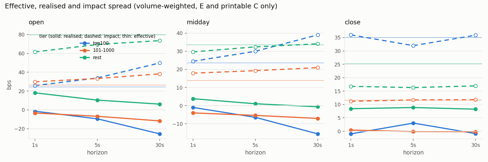
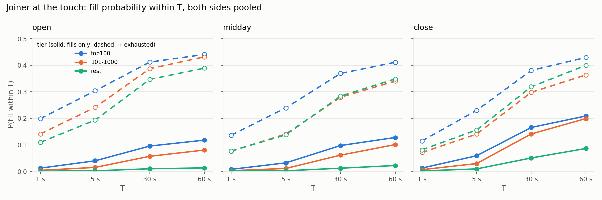

# numbers.md — 12302019

Every figure below is produced by `research/report.py` from the derived output of one full-day replay; nothing is typed in.
Prices in bps of the mid; sessions open [9:30, 10:00), midday [10:00, 15:30), close [15:30, 16:00) ET; tiers by that day's
E + printable C + P share volume rank (top100, 101-1000, rest), NASDAQ test symbols excluded.

## 1. Validation counters

Structural violations (six counters): **0**. Priority violation rate: **0.186 %** (10,565 / 5,683,178).

| counter                 |   value |
|:------------------------|--------:|
| badLength               |       0 |
| unknownType             |       0 |
| duplicateRef            |       0 |
| unknownRef              |       0 |
| execExceeds             |       0 |
| cancelExceeds           |       0 |
| noDirectory             |       0 |
| crossedInMarket         |       0 |
| crossedAtResume         |     642 |
| crossedAtResumeMaxLagNs | 1213892 |
| priorityChecked         | 5683178 |
| priorityViolations      |   10565 |
| duplicateMatch          |       0 |
| twoSidedMatches         |    4324 |
| brokenUnknown           |       0 |
| liveAtC                 |       0 |

## 2. Priority-violation classification

Violations dumped: **10,565**

| bucket | count | share | median queuePos | median levelCount | median burstSize | median execShares |
|---|---|---|---|---|---|---|
| burst | 9,455 | 89.5 % | 3 | 24 | 17 | 22 |
| isolated | 1,110 | 10.5 % | 1 | 10 | 1 | 100 |
| off_best | 0 | 0.0 % | — | — | — | — |
| gate_bug | 0 | 0.0 % | — | — | — | — |

## Detail

- burst: 82.2 % have an execution on the same symbol at the previous message's nanosecond (nsSinceLastExec == 0); queuePos 1 in 31.8 % of cases, <= 3 in 57.4 %.
- isolated: 44.5 % are odd-lot executions (< 100 shares); median nsSinceLastExec 521,430 ns; top symbols: ROKU (41), TSLA (37), SGMO (34), BYND (33), AAPL (31).

## Top symbols overall

| sym   |   violations |
|:------|-------------:|
| MSFT  |         1075 |
| AAPL  |          651 |
| TSLA  |          572 |
| BYND  |          541 |
| AMD   |          411 |
| AMZN  |          402 |
| ROKU  |          351 |
| GOOGL |          244 |
| NVDA  |          234 |
| FCEL  |          184 |

## 3. MeatPy cross-check (AAPL top-of-book at 1-minute marks)

```
marks ours=391 meatpy=391 joined=391 only-one-side=0 differing=0
```

## 4. Performance

See `docs/perf.md` (naive -> optimised tables, G1 and Generational ZGC, JFR). Not regenerated here.

## 5. Spreads by tier x session x horizon (volume-weighted bps; 95 % CI by 5-minute block bootstrap)

`eff` does not depend on the horizon; it is repeated per row for the CI. `impact = eff - real`.

| tier     | session   | h   |   n_exec |    volume |   eff |   eff_lo |   eff_hi |   real |   real_lo |   real_hi |   impact |   impact_lo |   impact_hi |
|:---------|:----------|:----|---------:|----------:|------:|---------:|---------:|-------:|----------:|----------:|---------:|------------:|------------:|
| top100   | open      | 1s  |   172820 |  40829647 | 24.28 |    20.92 |    26.97 |  -1.45 |     -4.28 |      1.93 |    25.74 |       22.49 |       29.30 |
| top100   | open      | 5s  |   172820 |  40829647 | 24.33 |    20.85 |    27.56 |  -9.53 |    -13.09 |     -6.39 |    33.86 |       28.60 |       39.27 |
| top100   | open      | 30s |   172820 |  40829647 | 24.30 |    21.03 |    27.26 | -25.51 |    -35.03 |    -17.99 |    49.81 |       41.47 |       60.69 |
| top100   | midday    | 1s  |   654374 | 172281578 | 23.48 |    20.80 |    26.87 |  -0.99 |     -3.34 |      1.76 |    24.48 |       22.04 |       27.60 |
| top100   | midday    | 5s  |   654374 | 172281578 | 23.49 |    20.67 |    26.81 |  -6.46 |     -8.65 |     -3.92 |    29.96 |       27.20 |       32.98 |
| top100   | midday    | 30s |   654374 | 172281578 | 23.45 |    20.76 |    26.74 | -15.57 |    -20.72 |    -11.45 |    39.02 |       34.11 |       44.76 |
| top100   | close     | 1s  |   111986 |  35036002 | 35.01 |    26.77 |    41.93 |  -0.98 |     -2.85 |      1.81 |    35.99 |       26.63 |       42.63 |
| top100   | close     | 5s  |   111986 |  35036002 | 35.01 |    26.80 |    39.94 |   3.04 |    -13.83 |     14.24 |    31.97 |       21.80 |       50.76 |
| top100   | close     | 30s |   111986 |  35036002 | 34.99 |    26.80 |    41.41 |  -0.88 |    -31.07 |     16.41 |    35.87 |       20.31 |       65.70 |
| 101-1000 | open      | 1s  |   294204 |  39535667 | 26.46 |    20.57 |    32.02 |  -3.37 |     -5.32 |     -0.57 |    29.84 |       24.01 |       35.60 |
| 101-1000 | open      | 5s  |   294204 |  39535667 | 26.44 |    20.58 |    32.13 |  -6.83 |     -8.64 |     -4.68 |    33.27 |       27.26 |       40.31 |
| 101-1000 | open      | 30s |   294204 |  39535667 | 26.46 |    20.40 |    31.65 | -11.76 |    -15.67 |     -8.97 |    38.22 |       29.50 |       47.13 |
| 101-1000 | midday    | 1s  |  1792417 | 203774850 | 13.89 |    13.24 |    14.50 |  -4.01 |     -4.60 |     -3.39 |    17.90 |       17.13 |       18.61 |
| 101-1000 | midday    | 5s  |  1792417 | 203774850 | 13.89 |    13.29 |    14.49 |  -5.39 |     -5.99 |     -4.80 |    19.28 |       18.42 |       20.21 |
| 101-1000 | midday    | 30s |  1792417 | 203774850 | 13.90 |    13.28 |    14.51 |  -7.06 |     -8.12 |     -6.10 |    20.95 |       19.75 |       22.17 |
| 101-1000 | close     | 1s  |   420856 |  51292184 | 11.61 |    10.53 |    14.00 |   0.43 |     -1.53 |      1.54 |    11.18 |        9.54 |       14.19 |
| 101-1000 | close     | 5s  |   420856 |  51292184 | 11.61 |    10.56 |    14.05 |  -0.09 |     -2.23 |      1.27 |    11.70 |        9.70 |       15.61 |
| 101-1000 | close     | 30s |   420856 |  51292184 | 11.62 |    10.53 |    13.79 |  -0.16 |     -3.66 |      2.45 |    11.77 |        8.36 |       17.20 |
| rest     | open      | 1s  |   173423 |  15300045 | 79.62 |    53.48 |   105.88 |  18.08 |      6.64 |     28.25 |    61.54 |       41.02 |       84.63 |
| rest     | open      | 5s  |   173423 |  15300045 | 79.74 |    55.37 |   107.64 |  10.33 |     -1.43 |     23.81 |    69.41 |       42.75 |      102.06 |
| rest     | open      | 30s |   173423 |  15300045 | 79.59 |    53.90 |   103.60 |   6.07 |     -8.15 |     19.12 |    73.52 |       44.55 |      110.57 |
| rest     | midday    | 1s  |  1672289 | 104800849 | 33.46 |    29.18 |    40.71 |   3.83 |      0.12 |      9.70 |    29.64 |       27.78 |       31.45 |
| rest     | midday    | 5s  |  1672289 | 104800849 | 33.43 |    28.97 |    40.15 |   1.02 |     -3.19 |      7.31 |    32.40 |       30.08 |       34.90 |
| rest     | midday    | 30s |  1672289 | 104800849 | 33.45 |    29.13 |    39.04 |  -0.63 |     -4.74 |      5.22 |    34.07 |       31.46 |       37.75 |
| rest     | close     | 1s  |   480661 |  31600754 | 25.18 |    21.83 |    28.17 |   8.42 |      3.95 |     11.26 |    16.76 |       15.40 |       20.14 |
| rest     | close     | 5s  |   480661 |  31600754 | 25.17 |    21.92 |    27.90 |   8.86 |      3.58 |     12.15 |    16.31 |       14.30 |       19.63 |
| rest     | close     | 30s |   480661 |  31600754 | 25.18 |    22.03 |    28.16 |   8.24 |      1.62 |     12.80 |    16.94 |       13.36 |       21.67 |



## 6. OFI: 1-second mid change (ticks) on OFI, per-symbol OLS, in-sample first 70 % of each session

Medians and quartiles across symbols with at least 30 in-sample and 10 out-of-sample windows; `beta` in ticks of mid change per
1,000 shares of imbalance; `share_r2_out_pos` = fraction of symbols whose out-of-sample R^2 is positive.

| tier     | session   |   symbols |   beta_med |   beta_q1 |   beta_q3 |   r2_in_med |   r2_out_med |   r2_out_q1 |   r2_out_q3 |   share_r2_out_pos |
|:---------|:----------|----------:|-----------:|----------:|----------:|------------:|-------------:|------------:|------------:|-------------------:|
| top100   | open      |       100 |      0.035 |     0.011 |     0.323 |       0.477 |        0.418 |       0.132 |       0.600 |              0.820 |
| top100   | midday    |       100 |      0.024 |     0.006 |     0.176 |       0.510 |        0.483 |       0.294 |       0.621 |              0.920 |
| top100   | close     |        98 |      0.020 |     0.005 |     0.126 |       0.611 |        0.364 |       0.143 |       0.596 |              0.796 |
| 101-1000 | open      |       886 |      0.702 |     0.163 |     3.215 |       0.381 |        0.317 |       0.069 |       0.509 |              0.777 |
| 101-1000 | midday    |       898 |      0.298 |     0.078 |     1.553 |       0.489 |        0.427 |       0.255 |       0.558 |              0.928 |
| 101-1000 | close     |       849 |      0.231 |     0.059 |     1.096 |       0.601 |        0.288 |      -0.039 |       0.539 |              0.703 |
| rest     | open      |      3990 |      3.437 |     0.781 |    12.587 |       0.186 |        0.067 |      -0.203 |       0.299 |              0.578 |
| rest     | midday    |      5790 |      1.802 |     0.489 |     5.759 |       0.203 |        0.135 |       0.007 |       0.322 |              0.762 |
| rest     | close     |      3969 |      1.513 |     0.448 |     4.779 |       0.284 |        0.059 |      -0.036 |       0.306 |              0.640 |

## 7. Queue-position fill probability (exact joiner episodes)

Episodes: **917,092** over 59 probed symbols (500,910 top100, 301,116 101-1000, 115,066 rest), both sides, sampled at the first
top-of-book change at or after each 1-second grid point, censored at 60 s. Outcome shares: filled 11.3 %, moved 41.5 %, exhausted 27.4 %, T 19.7 %, eod 0.1 %. Anomaly rate (an order behind the joiner filled first) 0.00 %. Cancellation share of queue movement ahead of joiners: **88.2 %**.

`p_fill` counts observed fills only (a lower bound); `p_fill_upper` also counts `exhausted` episodes at their exhaustion time.

### 7.1 Overall

|    T_s |   p_fill |   p_fill_upper |          n |
|-------:|---------:|---------------:|-----------:|
|  1.000 |    0.006 |          0.113 | 917092.000 |
|  5.000 |    0.024 |          0.201 | 917092.000 |
| 30.000 |    0.081 |          0.336 | 917092.000 |
| 60.000 |    0.113 |          0.387 | 917092.000 |

### 7.2 By tier x session (both sides)

| tier     | session   |      n |   p_fill_1s |   p_fill_5s |   p_fill_30s |   p_fill_60s |   p_fill_upper_5s |   p_fill_upper_60s |   cancel_share |   censor_moved |   censor_exhausted |   anomaly |   median_ahead0 |
|:---------|:----------|-------:|------------:|------------:|-------------:|-------------:|------------------:|-------------------:|---------------:|---------------:|-------------------:|----------:|----------------:|
| top100   | open      |  44426 |       0.012 |       0.040 |        0.095 |        0.118 |             0.304 |              0.441 |          0.890 |          0.484 |              0.323 |     0.000 |        1500.000 |
| top100   | midday    | 411170 |       0.008 |       0.032 |        0.097 |        0.128 |             0.240 |              0.411 |          0.891 |          0.433 |              0.284 |     0.000 |        1970.000 |
| top100   | close     |  45314 |       0.012 |       0.059 |        0.166 |        0.209 |             0.230 |              0.430 |          0.868 |          0.423 |              0.221 |     0.000 |        2624.000 |
| 101-1000 | open      |  25352 |       0.004 |       0.015 |        0.057 |        0.080 |             0.241 |              0.432 |          0.733 |          0.491 |              0.351 |     0.000 |         300.000 |
| 101-1000 | midday    | 242122 |       0.002 |       0.011 |        0.061 |        0.101 |             0.141 |              0.340 |          0.807 |          0.381 |              0.239 |     0.000 |         606.000 |
| 101-1000 | close     |  33642 |       0.006 |       0.029 |        0.141 |        0.199 |             0.140 |              0.364 |          0.748 |          0.370 |              0.165 |     0.000 |        1206.000 |
| rest     | open      |  10130 |       0.001 |       0.002 |        0.010 |        0.013 |             0.193 |              0.389 |          0.971 |          0.456 |              0.376 |     0.000 |         200.000 |
| rest     | midday    |  91860 |       0.001 |       0.002 |        0.012 |        0.022 |             0.138 |              0.348 |          0.976 |          0.385 |              0.326 |     0.000 |         400.000 |
| rest     | close     |  13076 |       0.002 |       0.009 |        0.051 |        0.086 |             0.156 |              0.400 |          0.937 |          0.373 |              0.314 |     0.000 |         500.000 |



### 7.3 By tier x session x side

| tier     | session   | side   |      n |   p_fill_5s |   p_fill_60s |   p_fill_upper_5s |   cancel_share |   median_ahead0 |
|:---------|:----------|:-------|-------:|------------:|-------------:|------------------:|---------------:|----------------:|
| top100   | open      | B      |  22213 |       0.043 |        0.117 |             0.308 |          0.905 |        1500.000 |
| top100   | open      | S      |  22213 |       0.037 |        0.119 |             0.300 |          0.875 |        1535.000 |
| top100   | midday    | B      | 205585 |       0.032 |        0.127 |             0.239 |          0.897 |        2100.000 |
| top100   | midday    | S      | 205585 |       0.033 |        0.129 |             0.240 |          0.884 |        1836.000 |
| top100   | close     | B      |  22657 |       0.061 |        0.213 |             0.241 |          0.877 |        2613.000 |
| top100   | close     | S      |  22657 |       0.057 |        0.205 |             0.219 |          0.860 |        2634.000 |
| 101-1000 | open      | B      |  12676 |       0.015 |        0.076 |             0.235 |          0.683 |         300.000 |
| 101-1000 | open      | S      |  12676 |       0.015 |        0.085 |             0.248 |          0.775 |         300.000 |
| 101-1000 | midday    | B      | 121061 |       0.012 |        0.106 |             0.142 |          0.764 |         600.000 |
| 101-1000 | midday    | S      | 121061 |       0.010 |        0.095 |             0.140 |          0.847 |         622.000 |
| 101-1000 | close     | B      |  16821 |       0.029 |        0.204 |             0.140 |          0.784 |        1148.000 |
| 101-1000 | close     | S      |  16821 |       0.030 |        0.195 |             0.140 |          0.711 |        1278.000 |
| rest     | open      | B      |   5065 |       0.002 |        0.011 |             0.190 |          0.970 |         200.000 |
| rest     | open      | S      |   5065 |       0.002 |        0.016 |             0.196 |          0.972 |         200.000 |
| rest     | midday    | B      |  45930 |       0.003 |        0.023 |             0.131 |          0.977 |         400.000 |
| rest     | midday    | S      |  45930 |       0.002 |        0.021 |             0.145 |          0.974 |         400.000 |
| rest     | close     | B      |   6538 |       0.009 |        0.096 |             0.168 |          0.928 |         488.500 |
| rest     | close     | S      |   6538 |       0.009 |        0.077 |             0.144 |          0.947 |         524.000 |

### 7.4 Conditional on initial queue size: P(fill within 5 s | ahead0 decile within tier) — the headline finding

| tier     |   decile |     n |   ahead0_min |   ahead0_median |   ahead0_max |   p_fill |   p_fill_upper |   cancel_share |
|:---------|---------:|------:|-------------:|----------------:|-------------:|---------:|---------------:|---------------:|
| top100   |        1 | 50091 |            1 |         100.000 |          200 |    0.043 |          0.506 |          0.552 |
| top100   |        2 | 50091 |          200 |         200.000 |          300 |    0.041 |          0.430 |          0.616 |
| top100   |        3 | 50091 |          300 |         400.000 |          500 |    0.041 |          0.378 |          0.655 |
| top100   |        4 | 50091 |          500 |         700.000 |         1000 |    0.048 |          0.294 |          0.592 |
| top100   |        5 | 50091 |         1000 |        1368.000 |         2000 |    0.049 |          0.259 |          0.641 |
| top100   |        6 | 50091 |         2000 |        2800.000 |         4000 |    0.045 |          0.225 |          0.718 |
| top100   |        7 | 50091 |         4000 |        5613.000 |         8121 |    0.040 |          0.177 |          0.757 |
| top100   |        8 | 50091 |         8121 |       11967.000 |        17768 |    0.028 |          0.112 |          0.791 |
| top100   |        9 | 50091 |        17768 |       23450.000 |        34916 |    0.013 |          0.051 |          0.883 |
| top100   |       10 | 50091 |        34922 |       63914.000 |       583450 |    0.005 |          0.012 |          0.942 |
| 101-1000 |        1 | 30112 |            1 |          14.000 |          100 |    0.021 |          0.342 |          0.520 |
| 101-1000 |        2 | 30112 |          100 |         100.000 |          104 |    0.016 |          0.334 |          0.603 |
| 101-1000 |        3 | 30111 |          104 |         198.000 |          201 |    0.019 |          0.233 |          0.575 |
| 101-1000 |        4 | 30112 |          201 |         300.000 |          398 |    0.019 |          0.177 |          0.580 |
| 101-1000 |        5 | 30111 |          398 |         500.000 |          600 |    0.017 |          0.175 |          0.684 |
| 101-1000 |        6 | 30112 |          600 |         794.000 |          965 |    0.014 |          0.099 |          0.722 |
| 101-1000 |        7 | 30111 |          965 |        1200.000 |         1518 |    0.010 |          0.058 |          0.745 |
| 101-1000 |        8 | 30112 |         1518 |        2039.000 |         3007 |    0.007 |          0.038 |          0.778 |
| 101-1000 |        9 | 30111 |         3007 |        4700.000 |         7600 |    0.006 |          0.027 |          0.806 |
| 101-1000 |       10 | 30112 |         7600 |       12003.000 |       109062 |    0.004 |          0.011 |          0.820 |
| rest     |        1 | 11507 |            1 |           3.000 |           15 |    0.005 |          0.179 |          0.708 |
| rest     |        2 | 11507 |           15 |         100.000 |          100 |    0.004 |          0.279 |          0.787 |
| rest     |        3 | 11506 |          100 |         100.000 |          175 |    0.007 |          0.197 |          0.663 |
| rest     |        4 | 11507 |          175 |         200.000 |          225 |    0.004 |          0.204 |          0.791 |
| rest     |        5 | 11506 |          225 |         300.000 |          400 |    0.004 |          0.151 |          0.799 |
| rest     |        6 | 11507 |          400 |         500.000 |          600 |    0.001 |          0.164 |          0.919 |
| rest     |        7 | 11506 |          600 |         701.000 |         1000 |    0.002 |          0.112 |          0.930 |
| rest     |        8 | 11507 |         1000 |        1163.000 |         1700 |    0.001 |          0.075 |          0.962 |
| rest     |        9 | 11506 |         1700 |        3300.000 |         6000 |    0.001 |          0.059 |          0.961 |
| rest     |       10 | 11507 |         6000 |       11300.000 |        28970 |    0.000 |          0.030 |          0.992 |


