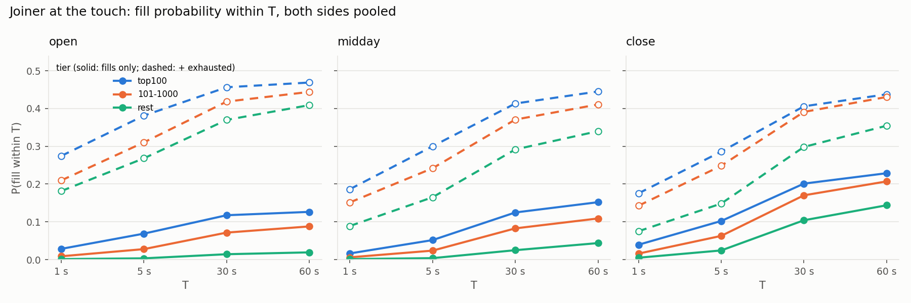
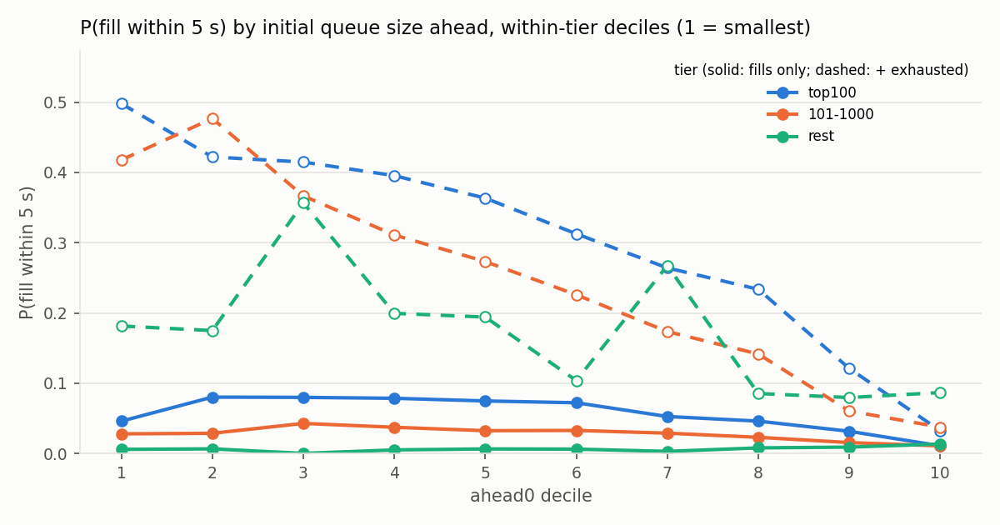

# numbers.md — S120825

Every figure below is produced by `research/report.py` from the derived output of one full-day replay; nothing is typed in.
Prices in bps of the mid; sessions open [9:30, 10:00), midday [10:00, 15:30), close [15:30, 16:00) ET; tiers by that day's
E + printable C + P share volume rank (top100, 101-1000, rest), NASDAQ test symbols excluded.

## 1. Validation counters

Structural violations (six counters): **0**. Priority violation rate: **0.234 %** (33,674 / 14,391,184).

| counter                 |    value |
|:------------------------|---------:|
| badLength               |        0 |
| unknownType             |        0 |
| duplicateRef            |        0 |
| unknownRef              |        0 |
| execExceeds             |        0 |
| cancelExceeds           |        0 |
| noDirectory             |        0 |
| crossedInMarket         |        0 |
| crossedAtResume         |    16669 |
| crossedAtResumeMaxLagNs |  3959811 |
| priorityChecked         | 14391184 |
| priorityViolations      |    33674 |
| duplicateMatch          |        0 |
| twoSidedMatches         |       32 |
| brokenUnknown           |        0 |
| liveAtC                 |        0 |

## 2. Priority-violation classification

Violations classified: **33,674** of **33,674** (all of them)

| bucket | count | share | median queuePos | median levelCount | median burstSize | median execShares |
|---|---|---|---|---|---|---|
| burst | 32,531 | 96.6 % | 3 | 154 | 117 | 10 |
| isolated | 1,101 | 3.3 % | 2 | 13 | 1 | 57 |
| off_best | 42 | 0.1 % | 0 | 3 | 8 | 29 |
| gate_bug | 0 | 0.0 % | — | — | — | — |

## Detail

- burst: 92.0 % have an execution on the same symbol at the previous message's nanosecond (nsSinceLastExec == 0); queuePos 1 in 15.5 % of cases, <= 3 in 50.1 %.
- isolated: 59.9 % are odd-lot executions (< 100 shares); median nsSinceLastExec 159,042 ns; top symbols: WVE (114), NVDA (59), IBIT (53), TLT (37), TTSH (31).
- off_best: order sits 3603 cents (median) behind the best displayed level, max 3828; 66.7 % odd lots; top symbols: SMX (22), IBIO (15), VIRC (3), CETX (1), TWG (1).

## Top symbols overall

| sym   |   violations |
|:------|-------------:|
| WULF  |         7429 |
| NFLX  |         3656 |
| NVDA  |         3566 |
| GOOGL |         1106 |
| TSLA  |          834 |
| AMZN  |          769 |
| COST  |          688 |
| GOOG  |          684 |
| AVGO  |          676 |
| INTC  |          571 |

## 3. MeatPy cross-check (AAPL top-of-book at 1-minute marks)

_not run on this day (need meatpy_AAPL.csv and meatpy_S120825_AAPL.csv)_

## 4. Performance

See `docs/perf.md` (naive -> optimised tables, G1 and Generational ZGC, JFR). Not regenerated here.

## 7. Queue-position fill probability (exact joiner episodes)

Episodes: **1,238,010** over 59 probed symbols (737,332 top100, 420,462 101-1000, 80,216 rest), both sides, sampled at the first
top-of-book change at or after each 1-second grid point, censored at 60 s. Outcome shares: filled 13.6 %, moved 46.4 %, exhausted 29.4 %, T 10.6 %, eod 0.0 %. Anomaly rate (an order behind the joiner filled first) 0.00 %. Cancellation share of queue movement ahead of joiners: **82.6 %**.

`p_fill` counts observed fills only (a lower bound); `p_fill_upper` also counts `exhausted` episodes at their exhaustion time.

### 7.1 Overall

|    T_s |   p_fill |   p_fill_upper |           n |
|-------:|---------:|---------------:|------------:|
|  1.000 |    0.014 |          0.174 | 1238010.000 |
|  5.000 |    0.044 |          0.278 | 1238010.000 |
| 30.000 |    0.110 |          0.395 | 1238010.000 |
| 60.000 |    0.136 |          0.430 | 1238010.000 |

### 7.2 By tier x session (both sides)

| tier     | session   |      n |   p_fill_1s |   p_fill_5s |   p_fill_30s |   p_fill_60s |   p_fill_upper_5s |   p_fill_upper_60s |   cancel_share |   censor_moved |   censor_exhausted |   anomaly |   median_ahead0 |
|:---------|:----------|-------:|------------:|------------:|-------------:|-------------:|------------------:|-------------------:|---------------:|---------------:|-------------------:|----------:|----------------:|
| top100   | open      |  63040 |       0.028 |       0.069 |        0.117 |        0.126 |             0.381 |              0.469 |          0.712 |          0.515 |              0.342 |     0.000 |         480.000 |
| top100   | midday    | 615078 |       0.016 |       0.052 |        0.125 |        0.152 |             0.300 |              0.445 |          0.834 |          0.469 |              0.293 |     0.000 |         701.000 |
| top100   | close     |  59214 |       0.039 |       0.102 |        0.201 |        0.229 |             0.286 |              0.438 |          0.804 |          0.453 |              0.209 |     0.000 |        1220.500 |
| 101-1000 | open      |  36580 |       0.009 |       0.028 |        0.072 |        0.088 |             0.310 |              0.444 |          0.842 |          0.526 |              0.356 |     0.000 |         132.000 |
| 101-1000 | midday    | 342946 |       0.006 |       0.024 |        0.083 |        0.109 |             0.242 |              0.411 |          0.876 |          0.455 |              0.302 |     0.000 |         216.000 |
| 101-1000 | close     |  40936 |       0.016 |       0.063 |        0.170 |        0.207 |             0.248 |              0.430 |          0.745 |          0.444 |              0.223 |     0.000 |         473.500 |
| rest     | open      |   7708 |       0.001 |       0.003 |        0.014 |        0.019 |             0.268 |              0.409 |          0.849 |          0.450 |              0.390 |     0.000 |         100.000 |
| rest     | midday    |  62906 |       0.001 |       0.004 |        0.025 |        0.044 |             0.165 |              0.340 |          0.671 |          0.404 |              0.296 |     0.000 |         100.000 |
| rest     | close     |   9602 |       0.005 |       0.024 |        0.104 |        0.144 |             0.148 |              0.354 |          0.439 |          0.402 |              0.211 |     0.000 |         222.000 |

### 7.3 By tier x session x side

| tier     | session   | side   |      n |   p_fill_5s |   p_fill_60s |   p_fill_upper_5s |   cancel_share |   median_ahead0 |
|:---------|:----------|:-------|-------:|------------:|-------------:|------------------:|---------------:|----------------:|
| top100   | open      | B      |  31520 |       0.069 |        0.130 |             0.385 |          0.614 |         487.000 |
| top100   | open      | S      |  31520 |       0.069 |        0.123 |             0.377 |          0.836 |         473.500 |
| top100   | midday    | B      | 307539 |       0.053 |        0.155 |             0.303 |          0.853 |         700.000 |
| top100   | midday    | S      | 307539 |       0.050 |        0.149 |             0.297 |          0.814 |         718.000 |
| top100   | close     | B      |  29607 |       0.093 |        0.219 |             0.278 |          0.809 |        1277.000 |
| top100   | close     | S      |  29607 |       0.112 |        0.238 |             0.294 |          0.799 |        1179.000 |
| 101-1000 | open      | B      |  18290 |       0.027 |        0.086 |             0.322 |          0.807 |         135.000 |
| 101-1000 | open      | S      |  18290 |       0.029 |        0.089 |             0.299 |          0.880 |         129.000 |
| 101-1000 | midday    | B      | 171473 |       0.025 |        0.110 |             0.246 |          0.871 |         208.000 |
| 101-1000 | midday    | S      | 171473 |       0.023 |        0.108 |             0.238 |          0.880 |         224.000 |
| 101-1000 | close     | B      |  20468 |       0.069 |        0.223 |             0.256 |          0.707 |         526.000 |
| 101-1000 | close     | S      |  20468 |       0.057 |        0.191 |             0.240 |          0.784 |         417.000 |
| rest     | open      | B      |   3854 |       0.003 |        0.018 |             0.272 |          0.838 |         100.000 |
| rest     | open      | S      |   3854 |       0.004 |        0.020 |             0.264 |          0.863 |         100.000 |
| rest     | midday    | B      |  31453 |       0.004 |        0.040 |             0.166 |          0.656 |         100.000 |
| rest     | midday    | S      |  31453 |       0.004 |        0.048 |             0.164 |          0.683 |         115.000 |
| rest     | close     | B      |   4801 |       0.024 |        0.148 |             0.155 |          0.489 |         200.000 |
| rest     | close     | S      |   4801 |       0.024 |        0.140 |             0.142 |          0.408 |         300.000 |

### 7.4 Conditional on initial queue size: P(fill within 5 s | ahead0 decile within tier) — the headline finding

| tier     |   decile |     n |   ahead0_min |   ahead0_median |   ahead0_max |   p_fill |   p_fill_upper |   cancel_share |
|:---------|---------:|------:|-------------:|----------------:|-------------:|---------:|---------------:|---------------:|
| top100   |        1 | 73734 |            1 |          13.000 |           39 |    0.046 |          0.498 |          0.640 |
| top100   |        2 | 73733 |           39 |          50.000 |           85 |    0.080 |          0.422 |          0.471 |
| top100   |        3 | 73733 |           85 |         120.000 |          175 |    0.080 |          0.415 |          0.448 |
| top100   |        4 | 73733 |          175 |         245.000 |          350 |    0.078 |          0.396 |          0.545 |
| top100   |        5 | 73733 |          350 |         500.000 |          703 |    0.075 |          0.363 |          0.613 |
| top100   |        6 | 73733 |          703 |        1110.000 |         2428 |    0.072 |          0.313 |          0.618 |
| top100   |        7 | 73733 |         2428 |        4149.000 |         6025 |    0.053 |          0.264 |          0.724 |
| top100   |        8 | 73733 |         6025 |        8200.000 |        11029 |    0.046 |          0.234 |          0.840 |
| top100   |        9 | 73733 |        11029 |       16743.000 |        30200 |    0.031 |          0.121 |          0.857 |
| top100   |       10 | 73734 |        30200 |       56678.000 |       900000 |    0.011 |          0.032 |          0.827 |
| 101-1000 |        1 | 42047 |            1 |          10.000 |           25 |    0.028 |          0.418 |          0.596 |
| 101-1000 |        2 | 42046 |           25 |          35.000 |           50 |    0.029 |          0.477 |          0.689 |
| 101-1000 |        3 | 42046 |           50 |          71.000 |          100 |    0.043 |          0.367 |          0.559 |
| 101-1000 |        4 | 42046 |          100 |         122.000 |          145 |    0.037 |          0.311 |          0.600 |
| 101-1000 |        5 | 42046 |          145 |         181.000 |          220 |    0.032 |          0.273 |          0.591 |
| 101-1000 |        6 | 42046 |          220 |         266.000 |          330 |    0.033 |          0.226 |          0.584 |
| 101-1000 |        7 | 42046 |          330 |         442.000 |          601 |    0.029 |          0.174 |          0.582 |
| 101-1000 |        8 | 42046 |          601 |         825.000 |         1510 |    0.023 |          0.142 |          0.658 |
| 101-1000 |        9 | 42046 |         1510 |        2879.000 |         5320 |    0.015 |          0.060 |          0.763 |
| 101-1000 |       10 | 42047 |         5320 |       12216.000 |        80704 |    0.011 |          0.037 |          0.901 |
| rest     |        1 |  8022 |            1 |           4.000 |           11 |    0.006 |          0.181 |          0.546 |
| rest     |        2 |  8022 |           11 |          23.000 |           40 |    0.006 |          0.175 |          0.589 |
| rest     |        3 |  8021 |           40 |          40.000 |           40 |    0.000 |          0.357 |          0.999 |
| rest     |        4 |  8022 |           40 |          50.000 |           81 |    0.005 |          0.199 |          0.736 |
| rest     |        5 |  8021 |           81 |         100.000 |          101 |    0.006 |          0.194 |          0.637 |
| rest     |        6 |  8022 |          101 |         121.000 |          166 |    0.006 |          0.104 |          0.543 |
| rest     |        7 |  8021 |          166 |         200.000 |          200 |    0.003 |          0.267 |          0.872 |
| rest     |        8 |  8022 |          200 |         254.000 |          325 |    0.008 |          0.085 |          0.561 |
| rest     |        9 |  8021 |          325 |         441.000 |          600 |    0.009 |          0.080 |          0.582 |
| rest     |       10 |  8022 |          600 |         970.000 |        10400 |    0.013 |          0.087 |          0.585 |

